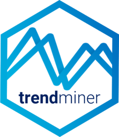
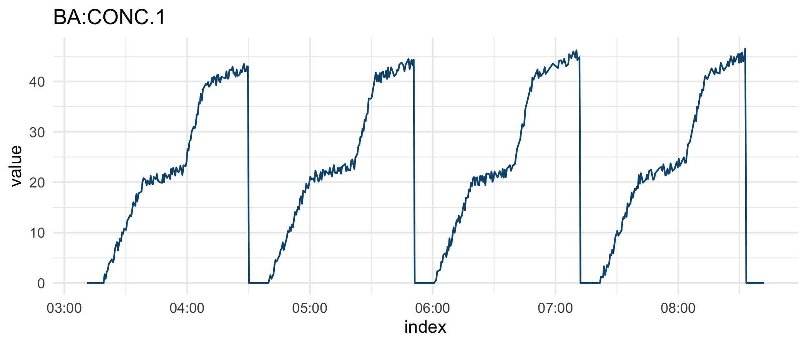

<!-- README.md is generated from README.Rmd. Please edit that file -->

# trendminer 

<!-- badges: start -->

[](https://travis-ci.com/TrendMiner/trendminer)
[](https://codecov.io/gh/trendminer/trendminer)
<!-- badges: end -->

trendminer is an R client for accessing selected endpoints of the
TrendMiner API that is documented at <http://developer.trendminer.com>.
TrendMiner is an industrial self-service analytics platform for
analyzing, monitoring and predicting time-series based process and asset
data.

## Installation

``` r
# install.packages("remotes")
remotes::install_github("alex23lemm/trendminer")
```

## Usage

Below are some things you can do after installing the package. Check out
the [introduction
vignette](https://trendminer.github.io/trendminer/articles/trendminer.html)
and [the
docs](https://trendminer.github.io/trendminer/reference/index.html) for
further details.

Start with fetching an access token which you’ll need for any subsequent
API call:

``` r
library(trendminer)

token <- tm_token()
```

Browse and explore the site/plant structures starting on top with the
available root structures:

``` r
library(dplyr)

# Get root structures
tm_af_root_structures(token) %>% 
  select(structureId, name)
#>                            structureId           name
#> 1 2b66622f-83c7-48e9-9ccc-6dd9214e70c6 Site Barcelona
#> 2 ca12dc39-516d-4217-b7cc-a8d220a32858  Site Grenoble
#> 3 783249ff-bfc3-4453-bd6a-27d9e71f03e2   Site Cologne

# Get child structures of Site Grenoble
tm_af_child_structures(token, "ca12dc39-516d-4217-b7cc-a8d220a32858") %>% 
  select(structureId, name, parentName)
#>                            structureId      name    parentName
#> 1 908d5613-b360-4ee7-b36b-02d097594850 Reactor 2 Site Grenoble
#> 2 2cd8f0c6-4bfc-49f9-9c0d-5c878d05eae6    Line 1 Site Grenoble

# Get entire subtree structure underneath Line 1
tm_af_descendant_structures(token, "2cd8f0c6-4bfc-49f9-9c0d-5c878d05eae6") %>% 
  select(name, parentName, type, tagName)
#>                        name    parentName      type      tagName
#> 1             Conveyer unit        Line 1     ASSET         <NA>
#> 2    Pressure polym reactor        Line 1 ATTRIBUTE WE-PIC001.PV
#> 3                Feed ratio        Line 1 ATTRIBUTE  WE-FY001.PV
#> 4          Production grade        Line 1 ATTRIBUTE  WE-AC001.PV
#> 5                 Feed flow        Line 1 ATTRIBUTE  WE-FC011.PV
#> 6       Reactor temperature Conveyer unit ATTRIBUTE WE-TIC001.PV
#> 7 Flow secondary addition 2 Conveyer unit ATTRIBUTE  WE-FC002.PV
#> 8         Conveyer pressure Conveyer unit ATTRIBUTE WE-PIC002.PV
#> 9 Flow secondary addition 1 Conveyer unit ATTRIBUTE  WE-FC001.PV
```

Search for specific assets/tags or retrieve all tags at once

``` r
# Retrieve all assets and tags that have "Reactor" in their name
tm_af_search_assets(token, 'name=="*Reactor*"') %>%
  select(nodeId, name, type) %>%
  head()
#>                                 nodeId                  name      type
#> 1 96b526da-aa76-46cb-8611-9c108303e755               Reactor     ASSET
#> 2 065e17e1-7569-49e6-9aea-c30f96081b86             Reactor 2     ASSET
#> 3 f75449bb-d144-40df-9d6a-d34a6a52f96f Reactor Concentration ATTRIBUTE
#> 4 af82c650-bbd5-4b58-9efa-880f205c6402         Reactor Level ATTRIBUTE
#> 5 07a7f300-f90b-458f-b334-3a0d7093d5ff   Reactor Temperature ATTRIBUTE
#> 6 f0cb8ec3-bf9b-4eb3-8959-8b179d0e8331             Reactor 1     ASSET

# Fetch all available tags
tm_af_tags(token) %>% 
  select(name, tagName) %>%
  head()
#>                    name     tagName
#> 1 Reactor Concentration  BA2:CONC.1
#> 2         Reactor Level  BA:LEVEL.1
#> 3 Reactor Concentration   BA:CONC.1
#> 4   Reactor Temperature   BA:TEMP.1
#> 5        Reactor Status BA:ACTIVE.1
#> 6        Reaction Phase  BA:PHASE.1
```

Fetch time series data of a tag:

``` r
library(lubridate)

start <-  ymd_hms("2019-09-15T03:10:14Z")
end <- ymd_hms("2019-09-15T08:42:15Z")

tag_data <- tm_ts_interpolated_data(token, "BA:CONC.1", start, end, 2)
head(tag_data$timeSeries)
#>                 index value
#> 1 2019-09-15 03:11:00     0
#> 2 2019-09-15 03:11:02     0
#> 3 2019-09-15 03:11:04     0
#> 4 2019-09-15 03:11:06     0
#> 5 2019-09-15 03:11:08     0
#> 6 2019-09-15 03:11:10     0
```

Visualize fetched time series data:

``` r
library(ggplot2)

tag_data$timeSeries %>%
  ggplot(aes(index, value)) +
  geom_line(color = "#09557f") +
  ggtitle(tag_data$tag$tagName) +
  theme_minimal()
```



## Authentication

All requests to the TrendMiner API require authentication using a valid
Bearer access token that is sent as part of the request headers.

Request tokens are obtained via OAuth2.0 using a resource owner password
credentials flow. Any client which likes to interact with the API needs
to collect the credentials from the user (username and password) and
passes them together with its own client credentials (client ID and
client secret) to the TrendMiner server using the `tm_token()` function.
The server responds with an access token which the user needs to use for
any subsequent API requests.

User credentials, client credentials and the TrendMiner base URL can be
passed as arguments to `tm_token()` for quick testing in interactive
mode. However, it is recommended to call `tm_token()` without arguments.
In this case `tm_token()` will fetch the credentials and the TrendMiner
base URL from the environment variables below which you need to store in
`.Renviron`. You can easily edit `.Renviron` using
`usethis::edit_r_environ()`.

``` r
TM_client_ID = YOUR_CLIENT_ID_HERE
TM_client_secret = YOUR_CLIENT_SECRET_HERE
TM_usr = YOUR_USER_NAME_HERE
TM_pwd = YOUR_USER_PASSWORD_HERE
TM_base_url = YOUR_TM_BASE_URL_HERE
```
